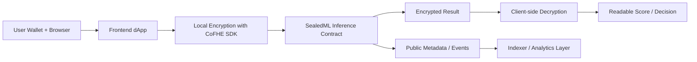
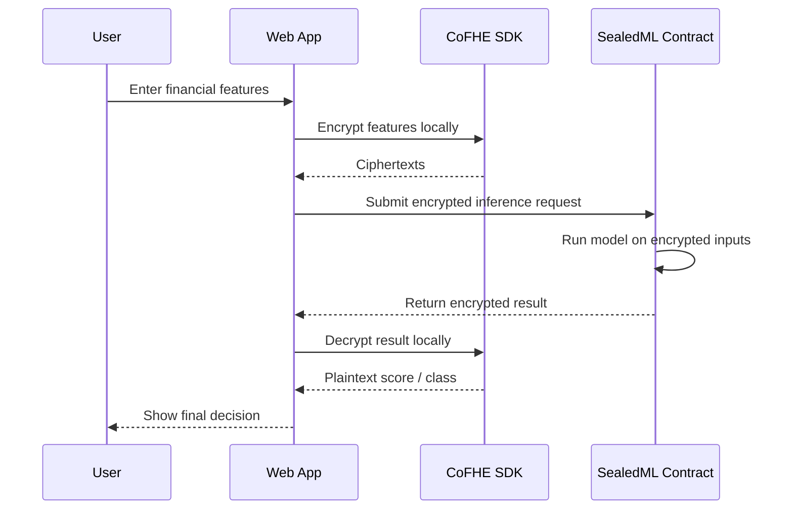

# SealedML

## Private AI Inference on Encrypted Financial Data

We are building **SealedML**, a privacy-first dApp that lets users run AI/ML inference on sensitive financial data **without exposing the raw data to anyone**. The user submits their data in encrypted form, our smart contract runs the model on encrypted inputs using **Fully Homomorphic Encryption (FHE)**, and the final score comes back encrypted so **only the user can decrypt it**.

This means we can offer things like private credit scoring, fraud detection, lending risk assessment, and financial reputation checks on-chain without forcing users to reveal their salary, bank history, liabilities, repayment patterns, or any other sensitive financial information.

Our app sits exactly in the category that the WaveHack / Fhenix privacy-by-design ecosystem is pushing forward: **real applications where confidentiality is not an add-on, but the foundation of the product itself**.

---

## What Our App Is

SealedML is a **privacy-preserving on-chain AI inference protocol**.

At the product level, it feels like a simple app:

1. A user connects their wallet.
2. They enter financial information in the frontend.
3. The frontend encrypts the data locally in the browser.
4. The encrypted data is sent to our smart contract.
5. Our model runs inference over encrypted values on-chain.
6. The contract returns an encrypted score or classification.
7. The user decrypts the final result client-side.

From the user side, the experience is simple.
From the architecture side, it is powerful because at no point do we expose the underlying financial data in plaintext.

---

## What Problem We Are Solving

Today, most AI-powered financial products work in a way that breaks privacy:

- A user uploads personal data to a centralized server.
- The company sees the raw data.
- The model runs off-chain.
- The user gets a score, but they must trust the operator with their most sensitive information.

This is a huge problem for:

- fintech products
- lenders
- underwriters
- digital banks
- compliance-heavy institutions
- DeFi protocols that want better risk models

Traditional blockchains do not solve this because they are transparent by default. If we put raw financial data on-chain, privacy is gone immediately.

So the core problem is simple:

**We want the benefits of on-chain verifiable logic and smart contracts, but we do not want to expose the data required to make the decision.**

That is exactly why SealedML exists.

---

## Why SealedML Matters

We are building SealedML because privacy is becoming a hard requirement, not a nice-to-have.

If a lending protocol, payroll system, stablecoin platform, or financial app wants to use AI for scoring or risk analysis, it cannot rely on a model that requires users to give away raw personal data. That creates:

- trust issues
- compliance issues
- data leak risk
- regulatory friction
- weak user adoption in privacy-sensitive markets

SealedML changes that tradeoff.

With our app:

- the user keeps ownership of their data
- the smart contract still performs the logic
- the result is still verifiable within the system
- the computation happens without revealing the input

So instead of choosing between **smart contracts** and **privacy**, we get both together.

---

## What Our App Does

Our app is designed to support privacy-preserving AI use cases such as:

- private credit scoring
- wallet risk scoring
- fraud detection for payments
- borrower eligibility checks
- underwriting pre-screening
- confidential user reputation scoring
- enterprise compliance-aware risk analysis

For the WaveHack version, our first and clearest use case is:

**encrypted financial data in, encrypted credit or risk score out**

That keeps the product focused, easy to demo, and technically strong.

---

## How Our App Works

### Step 1: User enters financial data

The user opens the dApp and inputs values like:

- income range
- repayment history
- current liabilities
- savings behavior
- transaction consistency
- wallet activity or on-chain financial history

The exact feature set depends on the model version we ship.

### Step 2: Data is encrypted in the browser

Before anything is sent on-chain, the frontend encrypts the user input locally using the Fhenix / CoFHE client stack.

That means:

- the backend never sees plaintext
- the blockchain never receives plaintext
- our own application logic never needs access to the raw values

### Step 3: Encrypted input is submitted to the smart contract

The encrypted feature vector is sent to our inference contract.

The contract stores only encrypted state and executes the scoring logic using FHE-compatible operations.

### Step 4: The model runs on encrypted data

Our model performs inference over ciphertexts.

For the MVP, we use a **small quantized model** so the logic remains practical for on-chain execution. This can be:

- a weighted scoring model
- logistic-style risk scoring
- a shallow neural network with bounded operations

The important part is that the **input remains encrypted during computation**.

### Step 5: Encrypted output is generated

The contract returns:

- an encrypted score
- or an encrypted risk class
- or an encrypted approval / reject style output

No one can read the result unless they hold the right decryption authority or permit.

### Step 6: User decrypts the result locally

The user decrypts the final result on the client side and sees:

- their score
- a decision band
- a confidence range
- or an application status

This gives the user a usable result without exposing the underlying personal data.

---

## Best Architecture for Our App

The best architecture for SealedML is a **privacy-first hybrid architecture**:

- local encryption on the client
- on-chain encrypted inference in Solidity
- client-side decryption for result ownership
- optional off-chain services only for public metadata, indexing, and notifications

This is the right architecture because it protects the most sensitive layer, keeps the core business logic verifiable, and avoids building a centralized trusted server that would weaken the whole point of the product.

### Our Architecture Decision

We are not building this as a normal Web2 AI app with a backend model server.

We are building it as:

1. **Frontend dApp**
2. **FHE-powered smart contract layer**
3. **Optional metadata/indexing layer**
4. **Client-side decryption layer**

That structure keeps the product aligned with Fhenix and with the privacy-native thesis of the buildathon.

---

## High-Level System Architecture



### Layer 1: Frontend dApp

The frontend is where the user interacts with SealedML.

Its responsibilities are:

- connect wallet
- collect user input
- normalize and validate feature values
- encrypt the input locally
- submit transactions
- fetch encrypted outputs
- decrypt results for display

We are building this layer with a modern React stack so we can move fast, keep the UX smooth, and integrate the Fhenix hooks cleanly.

### Layer 2: Encryption Layer

This is one of the most important parts of the product.

The encryption layer handles:

- client-side encryption of input data
- permit/decryption flow
- encrypted payload preparation
- secure result handling

This ensures the user stays in control of the sensitive data lifecycle from beginning to end.

### Layer 3: Smart Contract Inference Layer

This is the core of SealedML.

The contract layer is responsible for:

- accepting encrypted inputs
- storing encrypted state
- running deterministic inference logic
- managing model versions
- returning encrypted outputs
- enforcing access control around decryption permissions

This layer is what transforms SealedML from a normal app into a privacy-native protocol.

### Layer 4: Optional Off-Chain Services

We do not need a trusted backend for core inference.

But we do benefit from small off-chain services for:

- indexing public events
- analytics dashboards
- user activity feeds
- notification delivery
- model metadata display

These services must never depend on plaintext user data.

---

## Recommended Smart Contract Architecture

We split the contract system into focused modules instead of forcing everything into one contract.

### 1. `ModelRegistry`

This contract stores:

- model version
- feature schema
- model metadata
- activation status
- upgrade history

This gives us controlled model evolution without breaking trust in the scoring process.

### 2. `SealedMLInference`

This is the main inference engine.

It handles:

- receiving encrypted features
- executing FHE-compatible model logic
- generating encrypted scores
- mapping scores to classes or risk bands

This contract is the heart of the protocol.

### 3. `ResultManager`

This contract or module manages:

- result references
- ownership rules
- retrieval logic
- optional selective disclosure permissions

This is useful when we want users to later share a result with:

- a lender
- a DeFi protocol
- a compliance reviewer
- a partner application

### 4. `AccessControl / Permit Layer`

This layer handles:

- who can request decryption
- who can access result views
- how temporary permissions are granted

This is important because privacy is not just about encrypted storage. It is also about **controlled disclosure**.

---

## Recommended Repository Architecture

This is the cleanest structure for building the product properly:

```text
sealedml/
|-- apps/
|   `-- web/                      # Next.js frontend dApp
|-- contracts/
|   |-- src/
|   |   |-- ModelRegistry.sol
|   |   |-- SealedMLInference.sol
|   |   |-- ResultManager.sol
|   |   `-- AccessControl.sol
|   |-- scripts/
|   |-- test/
|   `-- hardhat.config.ts
|-- packages/
|   |-- ui/                       # Shared UI components
|   |-- config/                   # ABIs, addresses, chain config
|   |-- types/                    # Shared TS types
|   `-- sdk/                      # App-specific helpers for encryption/inference flow
|-- services/
|   `-- indexer/                  # Public metadata and event indexing only
|-- docs/
|   `-- architecture.md
`-- README.md
```

### Why this structure is best

This structure gives us:

- separation between frontend and protocol logic
- reusable packages
- clean contract testing
- easier deployment flow
- room to scale after the hackathon

It also keeps the project looking like a real product, not just a hackathon prototype.

---

## Model Design Strategy

The right way to build SealedML is to treat the ML layer carefully.

We are **not** trying to train a giant model on-chain.
We are building **deterministic private inference**.

### Our model strategy

- We train or define the model logic off-chain.
- We port the inference logic on-chain in a bounded form.
- We use quantized or fixed-point operations where needed.
- We keep the number of features controlled.
- We version the model so outputs remain reproducible.

### Best MVP model choice

For the first version, the strongest choice is:

- a weighted scoring model
- or a small logistic-style classifier
- or a shallow neural model with simple activation approximations

This is the best tradeoff between:

- privacy
- technical feasibility
- demo quality
- gas / compute constraints
- hackathon execution speed

So the product story remains ambitious, but the architecture remains realistic.

---

## Data Flow



---

## What Stays Private and What Becomes Public

One important part of our README is being honest about the privacy model.

### What stays private

- raw financial inputs
- intermediate model computations
- final result until the user decrypts it
- sensitive user-level scoring details

### What can still be public

- wallet address making the transaction
- transaction timing
- gas usage
- model version identifier
- public contract events that do not reveal plaintext

This is a strong and honest privacy posture. We protect what matters most, while still operating in a blockchain environment.

---

## Why This Architecture Is Strong

This architecture is strong for five reasons:

### 1. It is privacy-native

We are not hiding data after the fact. We are designing the whole flow so plaintext exposure never becomes part of the system.

### 2. It fits the Fhenix ecosystem directly

The buildathon is about building applications that use encrypted computation as a core primitive. SealedML does exactly that.

### 3. It solves a real market problem

Private financial scoring is not just a cool demo. It is useful for:

- fintech onboarding
- private lending
- undercollateralized credit systems
- institutional DeFi
- confidential compliance flows

### 4. It is technically impressive but still buildable

We are keeping the inference model intentionally small and focused so the MVP stays realistic.

### 5. It can grow into a full protocol

After the hackathon, SealedML can expand into:

- private model marketplaces
- encrypted underwriting engines
- privacy-preserving lending rails
- confidential B2B scoring APIs
- selective disclosure financial identity layers

---

## Tech Stack

This is the stack we are using to build SealedML properly.

### Blockchain / Smart Contracts

- Solidity
- Fhenix FHE / CoFHE smart contract libraries
- Hardhat for development, testing, and deployment

### Frontend

- Next.js
- React
- TypeScript
- Tailwind CSS
- wagmi / viem for wallet and chain interactions
- `@cofhe/react` hooks where needed

### Encryption / Privacy Tooling

- `@cofhe/sdk`
- Fhenix permit / decryption flow
- local browser-side encryption and decryption

### Optional Backend / Services

- Node.js service for public metadata and notifications
- PostgreSQL or Supabase for non-sensitive indexed data
- lightweight event indexer for app activity

### Developer Tooling

- Hardhat plugin support from the Fhenix ecosystem
- TypeChain or ABI-based TS bindings
- ESLint
- Prettier
- GitHub Actions for CI

---

## Core Product Features

The first release of SealedML includes:

- wallet connection
- encrypted financial input submission
- on-chain model inference
- encrypted result handling
- client-side result decryption
- model version display
- result history for the connected user

### Strong second-phase features

After the MVP, we can add:

- selective disclosure of results
- lender-facing verification flows
- multiple model types
- private risk tiers for DeFi protocols
- encrypted institution dashboards
- explainability summaries for the user

---

## User Journey

This is how a real user experiences SealedML:

1. The user connects their wallet.
2. They choose a product flow like private credit check or risk scoring.
3. They fill out the required financial information.
4. Their data is encrypted locally before submission.
5. The app sends the encrypted payload to the inference contract.
6. The contract computes the result on encrypted state.
7. The user receives the encrypted output.
8. The app decrypts it locally and shows the final score or decision.
9. If needed, the user can selectively share the outcome with a third party later.

This flow is smooth for the user while still being cryptographically strong underneath.

---

## Security and Privacy Principles

We are building SealedML around a few non-negotiable principles:

- plaintext user data is never required by the core app
- the smart contract operates on encrypted values only
- model logic is deterministic and versioned
- access to results is permissioned
- off-chain services never become privacy bottlenecks

These principles keep the product aligned with the entire reason it exists.

---

## MVP Scope for WaveHack

For the hackathon, the right MVP is not everything at once.
The right MVP is a clean, convincing, end-to-end private inference flow.

### MVP deliverables

- one clear use case: private credit / risk scoring
- one deployable smart contract inference flow
- one browser-based encryption + decryption flow
- one polished frontend demo
- one model version with a small number of features
- one privacy-first user story that judges can understand immediately

This makes the project strong because it is:

- understandable
- technically credible
- aligned with the buildathon theme
- demo-friendly

---

## Post-Hackathon Expansion

Once the MVP works, SealedML can evolve in major ways:

- multiple scoring models for different industries
- institution-specific private underwriting
- B2B API access for private scoring requests
- encrypted insurance risk checks
- private payroll and contractor reputation scoring
- confidential DeFi borrower assessment
- selective disclosure proofs for auditors or partners

This gives the project real startup potential beyond the competition.

---

## Why We Are Building This Now

We are building SealedML now because the market and the infrastructure are finally meeting at the same time.

The market needs:

- privacy-preserving finance
- compliant data handling
- better on-chain risk systems
- institution-friendly blockchain products

And the infrastructure now exists:

- Fhenix enables encrypted smart contract computation
- CoFHE makes developer integration practical
- privacy-first blockchain products are becoming not just possible, but necessary

That makes this the right moment to build SealedML.

---

## Why SealedML Fits WaveHack Perfectly

SealedML is a strong WaveHack project because it directly demonstrates:

- encrypted inputs
- encrypted on-chain computation
- privacy-first architecture
- real-world financial utility
- a clear path from hackathon demo to serious product

It is not privacy for novelty.
It is privacy solving a real product limitation that exists in fintech, lending, and DeFi right now.

---

## Final Vision

Our long-term vision is to make SealedML the private intelligence layer for financial applications.

Instead of forcing users to choose between:

- getting access to financial products
- and giving up their sensitive data

we are building a system where they can prove eligibility, receive scoring, and interact with financial logic **without exposing the underlying data itself**.

That is the core idea behind SealedML.

It is not just an AI app.
It is not just a privacy app.

It is a new way of doing financial intelligence on-chain.

---

## One-Line Summary

**SealedML is our privacy-first dApp for running AI inference on encrypted financial data on-chain, so users can get credit or risk decisions without ever exposing their raw information.**
